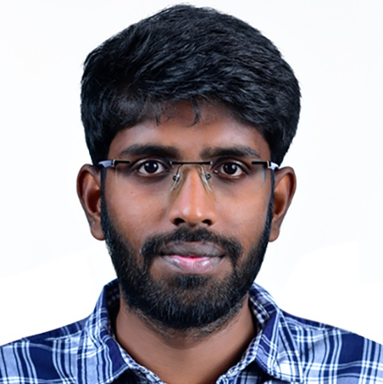

# Teachers

&nbsp;
&nbsp;

|Dr Elco Koks|Course coordinator|
|:-:|:--|
|  |Elco Koks is an Associate Professor within the department of Water and Climate Risk group at the Institute for Environmental Studies (IVM) and Honorary Research Fellow at the Oxford Programme for Sustainable Infrastructure Systems (OPSIS) at the University of Oxford, UK. His research combines knowledge from disaster impact modelling, critical infrastructure, network analysis and macroeconomics.|
  
&nbsp;
&nbsp;  

|Dr Thales Pupo-West||
|:-:|:--|
||Thales A.P. West is an Assistant Professor at the department of Environmental Geography and the Institute for Environmental Studies (IVM) at Vrije Universiteit Amsterdam and Fellow of the Centre for Environment, Energy and Natural Resource Governance (C-EENRG) at the University of Cambridge, UK. His research is focused on the sustainability of coupled human-natural systems and topics like land-use/cover change, resource management, environmental economics, impact evaluation (econometrics), climate governance, and payments for environmental services, e.g., REDD+ schemes.|

&nbsp;
&nbsp;  

|Marijn Ton, MSc||
|:-:|:--|
||Marijn Ton is a PhD candidate in the department of Water and Climate Risk of the Institute for Environmental Studies (IVM) at Vrije Universiteit Amsterdam (VU). She obtained a bachelor’s degree in Economics & Governance at Wageningen University and then continued her studies at VU Amsterdam, where she completed a master’s degree in Econometrics & Operations Research. In her PhD research, she studies coastal migration caused by climate change and sea level rise. She develops a global agent based model to simulate migration flows between 2020-2100 integrating flood projections and human migration decisions.|

&nbsp;
&nbsp;  

|Surender Raj V, M.Tech||
|:-:|:--|
||Surender Raj is a Ph.D. candidate in the department of Water and Climate Risk of the Institute for Environmental Studies (IVM) at Vrije Universiteit Amsterdam (VU). He completed his bachelor’s degree in Civil engineering from PSG College of Technology, Coimbatore. He did his master’s in Civil Engineering (specialization in Structural Engineering) from the Indian Institute of Technology Gandhinagar. His research interests include infrastructure resilience, vulnerability modeling, and the economic impacts of natural disasters.

&nbsp;
&nbsp;  

|Maria Fonseca, MSc||
|:-:|:--|
||Maria Fonseca is a PhD candidate in the department of Water and Climate Risk of the Institute for Environmental Studies (IVM) at Vrije Universiteit Amsterdam (VU). She obtained a bachelor’s degree in Civil Engineering at Western Institute of Technology and Higher Education in Mexico, and a master’s degree in Water Management at TU Delft. In her PhD research, she assesses climate risk of current and future wind and hail storm events, how the affects urban areas, communities and investments, and the available adaptation options to reduce the risks. |
