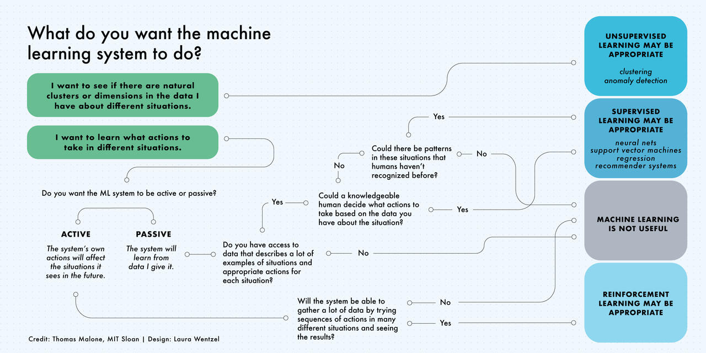

---
jupytext:
  cell_metadata_filter: -all
  formats: md:myst
  text_representation:
    extension: .md
    format_name: myst
    format_version: 0.13
    jupytext_version: 1.11.5
kernelspec:
  display_name: Python 3
  language: python
  name: python3
---

# Lecture: Course Introduction

This week we will kick-off the course. 

`````{admonition} Learning objectives week 1
:class: important
- Understand the concept of Big Data and how it can be used in sustainability sciences
- Know how this course is structured 
- Understand the basics of machine learning 
- Gain a basic understanding of Python and Jupyter Notebooks
`````

## Big data

`````{admonition} Definition of Big Data
:class: tip
Big data is a collection of massive and complex data sets and data volume that include the huge quantities of data, data management capabilities, social media analytics and real-time data. 
`````

## Definition of Machine Learning

The basic concept of machine learning in data science involves using statistical learning (i.e., finding a predictive function based on data) and optimization methods that let computers analyze datasets and identify patterns: it is all about making ***predictions*** and ***classification***. 

See these interactive examples from R2D3:

__[R2D3 Introduction to Machine Learning: Part 1](http://www.r2d3.us/visual-intro-to-machine-learning-part-1)__ 

__[R2D3 Introduction to Machine Learning: Part 2](http://www.r2d3.us/visual-intro-to-machine-learning-part-2)__ 

In general, a supervised machine learning algorithm consists of roughly three components:

1.	***A decision process:*** Calculation *steps/recipe* to use the data to achieve a goal (e.g., make a  prediction or classification). Based on patterns in the input data, the algorithm returns an output.

2.	***An error function:*** Evaluates the prediction/classification of the model (i.e., *model accuracy*). Did the decision process get it right? If not, how do you quantify “how bad” the miss was?

3. ***An optimization process:*** Iterations of the algorithm to *find better parameters values (or weights)* than previously estimated, repeated until a *maximum number of iterations* or a *minimum level of accuracy* is reached. The objective is to improve the initial “guess” of the model parameters and thus the overall performance of the model.

An example from NetFlix:

*Whenever you access the Netflix service, our recommendations system strives to help you find a show or movie to enjoy with minimal effort. We estimate the likelihood that you will watch a particular title in our catalog based on a number of factors including: your interactions with our service (such as your viewing history and how you rated other titles), other members with similar tastes and preferences on our service, and information about the titles, such as their genre, categories, actors, release year, etc. […] All of these pieces of data are used as inputs that we process in our algorithms.*

The algorithm’s job is to assign (initially through “guesses”) weights to the factors identified by NetFlix. If the algorithm gets it right, the weights it used stay the same. If it gets a movie wrong, the weights that led to the wrong decision get turned down so it doesn’t make that kind of mistake again. Since a machine learning algorithm updates such weights automatically, its accuracy improves with each ***iteration*** as it ***learns*** from the data it analyzes, often times uncovering hidden insights without being specifically programmed to do so. 

## Types of Machine Learning

There are many types of machine learning models defined by the presence or absence of human influence on raw data:

1. ***Supervised learning:*** The dataset being used has been pre-labeled and classified by users to allow the algorithm to see how accurate its performance is.

2. ***Unsupervised learning:*** The raw dataset being used is unlabeled and an algorithm identifies patterns and relationships within the data without help from users.

3. ***Semi-supervised learning:*** The dataset contains structured and unstructured data, which guides the algorithm on its way to making independent conclusions. The combination of the two data types in one training dataset allows machine learning algorithms to learn to label unlabeled data.

4. ***Reinforcement learning:*** The dataset uses a “rewards/punishments” system, offering feedback to the algorithm to learn from its own experiences by trial and error.



## Commonly Used Machine Learning Algorithms

The purpose of machine learning is to use machine learning algorithms to analyze data in order to make predictions and/or classification. There are a number of machine learning algorithms that are commonly used worldwide. Each of these machine learning algorithms can have numerous applications in a variety of academic and business settings. 

### Linear Regressions

Linear regression is an algorithm used to analyze linear relationships between independent input variables and at least one response variable. In other words, the linear regression models attempt to map a straight line, or a linear relationship, through the data. If statistical assumptions are not violated, we can also interpret the statistical significance of the parameters estimated by the linear models (i.e., are they different from zero?) and thus the influence of our variables in the system we are studying.

### Logistic Regressions

Logistic regression is a supervised learning algorithm commonly used for classification problems. Instead of continuous output like in linear regression, a logistic model predicts the probability of a binary (e.g., yes/no) event occurring. For example, the likelihood of deforestation in a location of the Amazon rainforest.

### Neural Networks

Neural networks, also known as artificial neural networks (ANNs) or simulated neural networks (SNNs), are a subset of machine learning and are at the heart of deep learning algorithms and artificial intelligence. These algorithms attempt to replicate the way the human brain processes information to understand and intelligently classify data and predict outcomes. Neural network algorithms are designed to quickly learn from input training data and improve their accuracy with each model iterations, constructing complex, non-linear relationships among the input variables.

### Decision Trees

Decision trees can be used for both predicting numerical values (regression) and classifying data into categories. Decision trees use a branching sequence of linked decisions that can be represented with a tree diagram. One of the advantages of decision trees is that they are easy to inspect (unlike the complex, “black box” of the neural network). 

### Random Forests

Random forest models are capable of classifying data using hundreds (if not thousands) of decision trees all at once. Like decision trees, random forests can be used to determine the classification of categorical variables or the regression of continuous variables. These random forest models generate a number of decision trees as specified by the user, forming what is known as an ensemble (or should we call it a “forest,” get it?) Each tree then makes its own prediction based on some input data, and the random forest machine learning algorithm then makes a prediction by combining the predictions of each decision tree in the ensemble. 

## Why is Machine Learning relevant?

1.	***Processing capabilities:*** Processing power is more efficient and readily available. Algorithms can be programmed to process data on their own, determine conclusions, and identify patterns are invaluable in a world where massive volumes of data are collected and become available on a daily basis (***“big data”***).

2.	***Unexpected findings:*** Since a machine learning algorithm updates itself autonomously, accuracy improves with each run as it ***learns*** from the data and complex relationships are established, algorithms can gain unexpected insights about a system or problem without being specifically programmed to do so.

## Python
Python is a programming language which allows us to give instructions to the computer. These instructions can be as simple as "add together these two numbers" or as complex as "give me the average CO2 concentration for 2020". For the former we will be able to complete the task using only a single instruction but for the latter, we may have to write a larger program containing hundreds or thousands of instructions.

This course is going to start from the beginning, showing you to talk to the computer to perform simple tasks and as you become more confident and follow the later courses, you will find that you are able to write much more complex programmes. Within this course, we assume no prior knowledge of Python. Experience with programming concepts or another programming language will help, but is not required to understand the material.

Python is a well-established language, with the current version (version 3) released in 2008 and it is installed by default on nearly all modern Linux systems. Python is also available for OS X and Windows.

```{seealso} 
You can find much more info about Python [here](https://docs.python.org/3/faq/general.html#what-is-python)
```